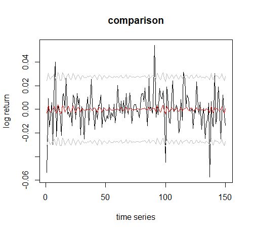
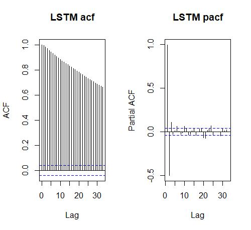

# ARIMA vs LSTM	- 基于指数收益率的预测效果对比分析

## 简介

杨青,王晨蔚.基于深度学习LSTM神经网络的全球股票指数预测研究[J].统计研究,2019,36(03):65-77.

SIMA SIAMI NAMIN1, AKBAR SIAMI NAMIN2 FORECASTING ECONOMIC AND FINANCIAL TIME SERIES: ARIMA VS. LSTM

项目思路参照了以上两篇文章: 分别使用ARIMA模型和深度学习中的LSTM模型对时间序列数据进行预测. 最后使用某种指标对比预测效果.

## 数据来源

我们使用2009年5月到2019年5月的上证50, 沪深300, 中小板指数, 深证成指四个指数的时序数据进行研究. 在参考文献中, 使用了12个指数数据,来训练同一个模型,  但我们则是对每一个指数训练了一个模型进行. 因为我们认为原文的目的是希望训练出一个普适性的模型, 但如果要做一些实质性的用途的话, 比如量化策略, 应该是需要一个更有针对性的模型. 所以采取了这样一个改进措施

## 建模思路

### ARIMA

arima的建模思路比较简单, 老师上课的时候也讲的比较清楚. 首先是对价格取对数, 并检验序列是否平稳, 如果不平稳的话就需要进行差分. 差分后根据acf和pacf以及AIC法则进行定阶.


## 神经网络预测思路

### LSTM结构

LSTM神经元的输入是序列数据, 在每个样本数据中都有时间步和特征这两个维度, 在我们这个模型中, LSTM在根据某一个样本进行训练或者预测时, 会按照时间步读取特征. 然后进行计算, 在每一个时间步中,都会使用上一个时间步的输出作为输入. 在计算时, 会根据参数决定上一个时间步的输出和这一个时间步中的特征输入对输出的影响. 而这些参数都是通过反向传播算法进行训练得到的. 需要注意的是, 与图中不同, 我们的LSTM是在一个样本的时间步都走完后才会有输出预测值, 而不是在每个时间步都有一个预测值. 


### 模型结构


==**两张图的预测收盘价都改成对数收益率**==

## 建模过程

对数收益率观察


### arima 


最终定阶为ARIMA(3,0,2 ) ,

```R

Call:
arima(x = dlogSZ50Pri, order = c(3, 0, 2), include.mean = F)

Coefficients:
         ar1      ar2     ar3      ma1     ma2
      0.2177  -0.9609  0.0741  -0.1691  0.9165
s.e.  0.0428   0.0179  0.0245   0.0371  0.0240

sigma^2 estimated as 0.0001899:  log likelihood = 5728.22,  aic = -11444.43 

```

简单地将估计值除以标准误差, 我们发现值都大于2 , 所以模型参数不需要修正. 

### LSTM

LSTM建模过程并不顺利, 一开始我们是复现了参考论文的模型, 

一个流程图:  input->batch normalization layer -> LSTM->dropout-> LSTM-> dropout-> output layer

bn层实际上就是将数据的归一化放到神经网络中去做, 让神经网络自己去学习出一个均值和方差来对数据进行变换. 


发现效果非常差. 通过将模型结果输出, 发现模型的输出非常单调, 非常容易在某段时间里重复出现相同的预测值. 感觉模型复杂度可能过高了, 于是我们尝试简化模型

input-> LSTM->dropout->output layer

同时我们也尝试了自己做batch normalization 而不是交给神经网络去做. 最后发现简单的模型效果反而更好. 

## 结果分析

对于ARIMA模型, 我们使用滚动提前1期进行回测., 根据预测时间长度划分预测时间的长短, 最后分为了短中长三期

| 短期(5) | 中期(60) | 长期(150) |
| ------- | -------- | --------- |
| 85%     | 110%     | 120%      |

而LSTM则是在经过几次变换后,效果仍然是不理想. 即便是在训练集下,它的效果都不如ARIMA模型

| 复杂模型 | 简单模型 | 手动BN的模型 |
| -------- | -------- | ------------ |
| 429%     | 274%     | 208%         |

最后, 我们将两个模型的预测效果进行了可视化展示.




第一张图是 ARIMA模型预测值与实际值的对比, arima的预测值是围绕着均值上下波动,

第二张图是LSTM各个模型预测值与实际值的对比, 黑色的实际值, 有色彩的是预测值, 复杂度较高的模型最终都在0左右波动, 而复杂度低的模型则是趋势的连续性.

随后, 我们查看了LSTM预测值的ACF图, 发现LSTM的预测值具有高阶自相关. 这说明了 即便LSTM中的结构通过更新门, 遗忘门 与能够让预测序列产生自相关以及截断这种自相关. 我们也希望模型能够通过训练学会一个较好的参数, 但最后这种预测值的高阶自相关说明了 模型并不能学会一个好的参数, 很可能最后就是让前面的时间步对后面的时间步始终产生影响.



最后 , 我们结论则是, 模型并不是越复杂越好, 神经网络模型也不是万能的. 对于收益率序列这样的没有相关性强的解释变量的来说, 一个好的建模逻辑是更为重要的. 在ARIMA中, 我们是考虑了收益率的自相关, 而在老师上课讲到的ADT模型中, 则是将价格变动分解为了三部分. 这些建模逻辑虽然并不能完全解释收益率的变动, 但也是逻辑自洽的. 而在神经网络中, 如果我们直接将数据扔给网络让他自己去学习出一个逻辑, 从结果上来看, 神经网络并不能学到一个好的逻辑. 而这样的逻辑产生的预测结果也不如arima这样一个简单有效的模型结果好